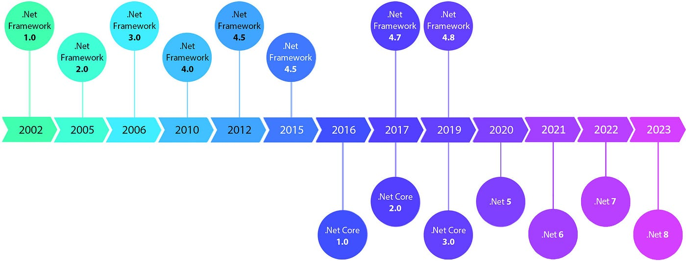
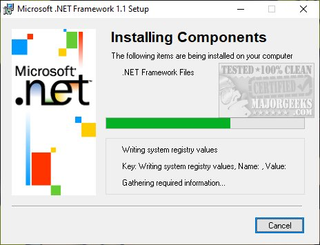
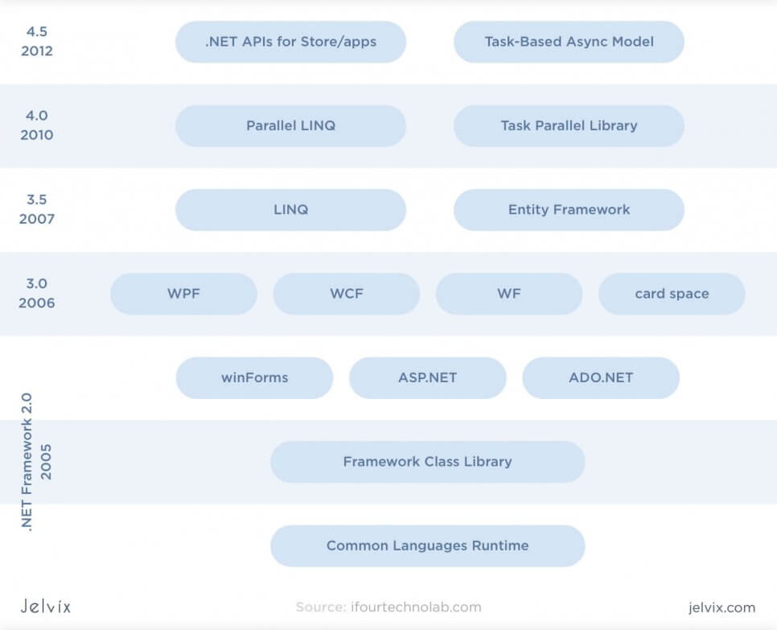
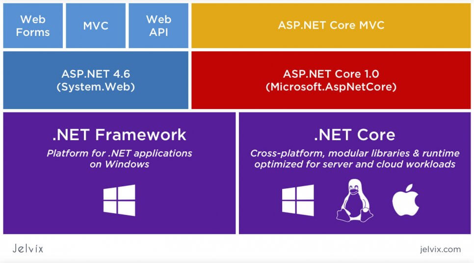
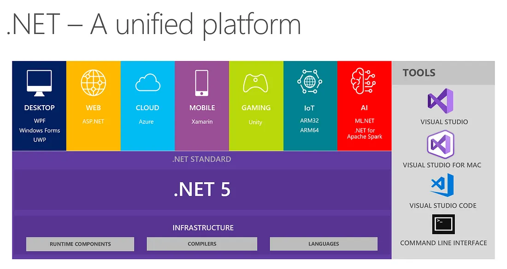
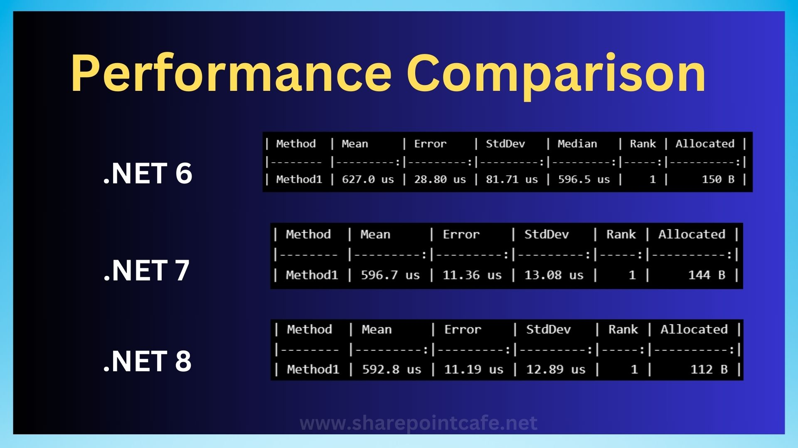
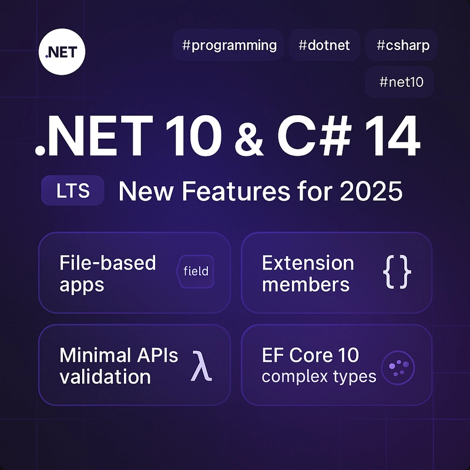
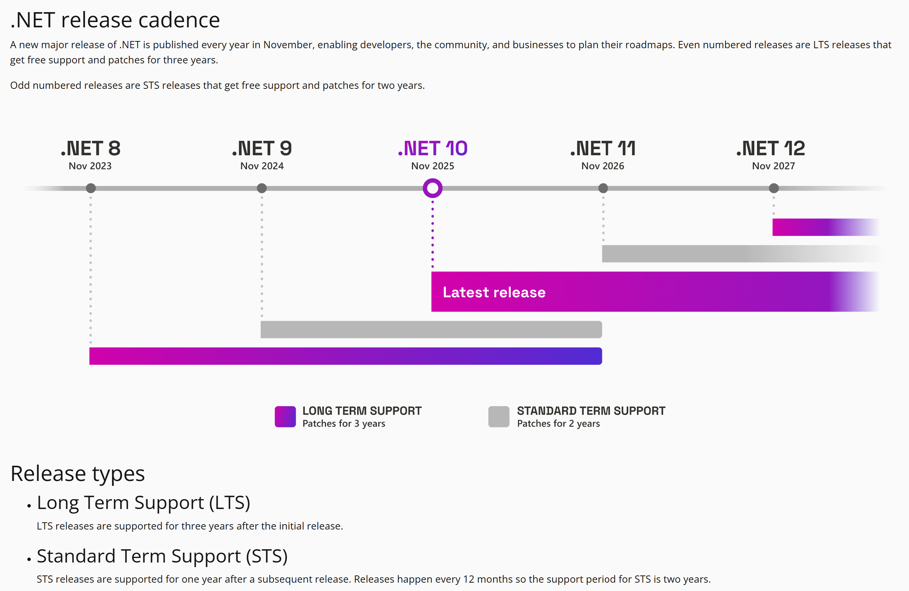

# 🧭 Sessão 1 — Panorama do C# 14 e .NET 10

## 🎯 Objetivo da Aula

Apresentar a evolução das tecnologias C# e .NET, destacando o posicionamento do .NET 10 no ecossistema Microsoft e os principais recursos introduzidos no C# 14.

---

# 📚 1. Linha do Tempo do .NET




## 1.1 .NET Framework → .NET Core → .NET 5 → .NET 10

### **.NET Framework (2002–2019)**

* Focado em Windows e ambiente corporativo.
* Monolítico, não open-source.
* Base de muitas aplicações legadas.





>Fonte:
https://jelvix.com/blog/asp-net-vs-asp-net-core

### **.NET Core (2016–2020)**

* Multiplataforma.
* Open-source (fundação: .NET Foundation).
* Performance muito superior ao Framework.
* Modular e otimizado para cloud.



> Fonte:  
https://jelvix.com/blog/asp-net-vs-asp-net-core

### **.NET 5 (2020)**

* Início da unificação: uma única plataforma .NET para todos os cenários.
* Novo ciclo de releases anuais.
* Melhorias contínuas em performance e APIs.
* Suporte a containers e cloud-native.
  


>Fonte:
https://marcionizzola.medium.com/estou-come%C3%A7ando-como-diferenciar-c-net-net-core-net-framework-net-mvc-968fb993abc0

### **.NET 6, 7, 8 e 9**

* 6: LTS, performance massiva.
* 7: foco em cloud-native e containers.
* 8: AOT nativo, simplificação de aplicações minimalistas.
* 9: otimizações incrementais (AI e interop com WASM).



>Fonte:
https://www.sharepointcafe.net/2024/04/comparing-net-6-net-7-and-net-8-performance.html
https://docs.microsoft.com/pt-br/dotnet/core/whats-new/dotnet-6

### **.NET 10 (2025)**

* Consolidação da plataforma cloud-native.
* Avanços robustos em AOT.
* Interoperabilidade com IA nativa no runtime.
* Mais otimizações para containers.
  


> Fonte:
https://learn.microsoft.com/en-us/dotnet/core/whats-new/dotnet-10/overview
https://dev.to/cristiansifuentes/new-features-in-net-10-c-14-the-experts-playbook-2025-2pe5


### **.NET 11+ (Futuro)**



> Fonte:
https://dotnet.microsoft.com/en-us/platform/support/policy/dotnet-core  

---

# ⚙️ 2. O Papel do .NET 10 no Ecossistema Moderno

## 2.1 AOT Aprimorado

* Compilação Ahead-of-Time mais completa.
* Tempos de startup muito menores.
* Ideal para microsserviços e aplicações serverless.

>Ahead-of-Time Compilation — ou compilação antecipada — é o processo de compilar o código-fonte para código de máquina nativo antes da execução do programa.
Ou seja: o código já chega pronto para rodar, sem precisar converter nada enquanto o programa está funcionando.
> Em contraste, a compilação Just-In-Time (JIT) ocorre durante a execução do programa, convertendo o código intermediário em código de máquina conforme necessário.

## 2.2 Containers Primeiro

* Imagens oficiais mais leves.
* Suporte aprimorado a distroless.
* Depuração e profiling simplificados.

## 2.3 Cloud-Native Sem Fricção

* Integrações melhores com Kubernetes.
* Otimizações para workloads escaláveis.
* Novos templates e tooling para arquiteturas distribuídas.

## 2.4 .NET para IA

* Interop nativa com ONNX e runtimes de inferência.
* Otimizações no uso de GPU.
* APIs simplificadas para modelos customizados.

---

# 📘 3. Evolução do C#: Sintaxe e Paradigmas

## 3.1 Das versões antigas ao C# moderno

* C# 1–4: OOP tradicional (classes, herança, generics).
* C# 5–7: Programação assíncrona (async/await), pattern matching.
* C# 8–11: Nullable reference types, record types, lambdas estendidas.
* C# 12–13: Primary constructors, interceptors, default lambdas.

## 3.2 C# 14 (2025) — Novidades

* **Pattern Matching Avançado**: padrões mais expressivos e semanticamente ricos.
* **Improvements in Primary Members**: ainda mais concisão em classes e structs.
* **Enhanced Collections Literals**: criação de coleções com sintaxe reduzida.
* **Inline Il** (experimental): instruções intermediárias para otimizar cenários críticos.
* **AI-Assisted APIs**: novos atributos e anotações para modelos.

---

# 🧭 4. Tendências do Roadmap Microsoft

## 4.1 .NET

* Crescimento do AOT.
* Prioridade em redução de cold start.
* Ferramentas para cloud-native.

## 4.2 AI

* .NET integrado com Azure AI.
* APIs unificadas para modelos open e closed source.
* Compatibilidade nativa com ONNX e TensorRT.

## 4.3 Interoperabilidade

* Suporte a WebAssembly no navegador e no servidor.
* Melhoria no binding entre C#, Python e JavaScript.
* Expansão do NativeAOT.

---

# 💻 5. Demo (Teórica / Preparação)

## Comparação de Código — C# 12 vs C# 14

### C# 12 (exemplo)

```csharp
public class Pessoa
{
    public string Nome { get; }
    public int Idade { get; }

    public Pessoa(string nome, int idade)
    {
        Nome = nome;
        Idade = idade;
    }
}
```

### C# 14 (exemplo — mais conciso)

```csharp
public class Pessoa(string Nome, int Idade);
```

### Pattern Matching Evoluído

```csharp
if (pessoa is { Idade: > 18, Nome: not null })
    Console.WriteLine("Maior de idade e nome válido");
```

---

# 🛠️ 6. Atividade Prática

## Objetivo

Explorar diferenças sintáticas e de performance entre versões anteriores e o .NET 10.

## Propostas de Atividades

* Rodar benchmarks de inicialização (startup) em apps .NET 8 vs .NET 10.
* Comparar versões de código equivalentes (C# 12 vs C# 14).
* Analisar binários gerados com AOT.
* Testar execução em containers distroless.

---

# 📝 7. Conclusão

* O .NET 10 consolida a plataforma para cloud-native e IA.
* O C# 14 entrega ainda mais expressividade e produtividade.
* A evolução da plataforma continua alinhada à estratégia "+cloud, +AI" da Microsoft.


---
Moongy 2025 - Todos os direitos reservados