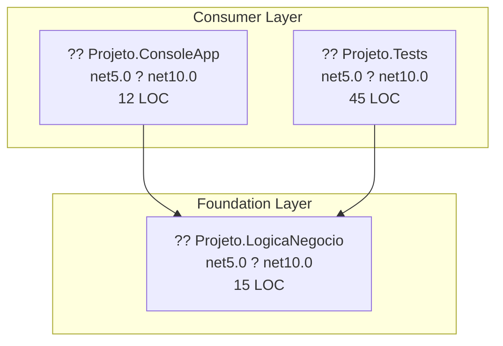

# .NET 10.0 Upgrade Plan

## Table of Contents

- [Executive Summary](#executive-summary)
- [Migration Strategy](#migration-strategy)
- [Detailed Dependency Analysis](#detailed-dependency-analysis)
- [Project-by-Project Migration Plans](#project-by-project-migration-plans)
- [Package Update Reference](#package-update-reference)
- [Breaking Changes Catalog](#breaking-changes-catalog)
- [Testing & Validation Strategy](#testing--validation-strategy)
- [Risk Management](#risk-management)
- [Complexity & Effort Assessment](#complexity--effort-assessment)
- [Source Control Strategy](#source-control-strategy)
- [Success Criteria](#success-criteria)

---

## Executive Summary

### Scenario Description
This plan guides the upgrade of the FormacaoTdd solution from .NET 5.0 to .NET 10.0 (Long Term Support). The solution consists of 3 projects with a simple, linear dependency structure.

### Scope

**Projects Affected:**
- `Projeto.LogicaNegocio` - Business logic class library (15 LOC)
- `Projeto.ConsoleApp` - Console application (12 LOC)
- `Projeto.Tests` - MSTest test project (45 LOC)

**Current State:**
- All projects targeting `net5.0`
- 4 NuGet packages (all compatible with net10.0)
- 72 total lines of code
- All projects are SDK-style (modern format)

**Target State:**
- All projects targeting `net10.0`
- All packages remain compatible (no updates required)
- Zero API incompatibilities detected

### Selected Strategy

**All-At-Once Strategy** - All projects upgraded simultaneously in a single operation.

**Rationale:**
- **Small solution**: Only 3 projects with 72 total LOC
- **Simple dependencies**: Linear structure with clear dependency order (LogicaNegocio is leaf node)
- **Low risk**: All packages are compatible, no API breaking changes detected
- **No security issues**: Zero vulnerabilities found
- **Modern projects**: All SDK-style projects simplify the upgrade process

### Discovered Metrics

| Metric | Value | Assessment |
|--------|-------|------------|
| Total Projects | 3 | Small solution |
| Dependency Depth | 2 levels | Simple structure |
| Total LOC | 72 | Very small codebase |
| Packages | 4 (100% compatible) | No package updates needed |
| API Issues | 0 | No breaking changes |
| Security Vulnerabilities | 0 | Clean security posture |
| High-Risk Projects | 0 | All low complexity |

### Complexity Classification

**Simple Solution** - Ideal for all-at-once upgrade approach

**Key Characteristics:**
- ? ?5 projects
- ? Dependency depth ?2
- ? No high-risk indicators
- ? No security vulnerabilities
- ? All packages compatible
- ? All projects SDK-style

### Iteration Strategy

**Fast Batch Approach** - Complete plan in 2-3 detail iterations:
1. Foundation sections (dependency analysis, strategy, stubs)
2. All project details in single batch
3. Final sections (testing, risk, success criteria)

### Critical Issues

? **None identified** - This is a straightforward upgrade with minimal risk.

### Recommended Approach

Execute as a **single atomic operation**:
1. Update all 3 project files simultaneously
2. Restore dependencies
3. Build and validate
4. Run tests

**Estimated Impact:** Minimal code changes expected. Framework upgrade only—no package updates or API changes required.

---

## Migration Strategy

### Approach Selection

**Selected: All-At-Once Strategy**

All three projects will be upgraded simultaneously in a single atomic operation, moving from net5.0 to net10.0 together.

### Justification

**Why All-At-Once is Optimal:**

1. **Small Solution Size**
   - Only 3 projects
   - 72 total lines of code
   - Entire codebase can be comprehended and tested quickly

2. **Simple Dependency Structure**
   - Linear dependencies (no complex web)
   - One leaf node (LogicaNegocio) with two consumers
   - No circular dependencies

3. **Zero Breaking Changes**
   - All 4 NuGet packages are compatible with net10.0
   - No API incompatibilities detected (27/27 APIs compatible)
   - No code changes required beyond framework version

4. **Low Risk Profile**
   - No security vulnerabilities
   - No package updates needed
   - All projects are SDK-style (modern format)
   - Test coverage exists (Projeto.Tests with 45 LOC)

5. **Efficiency Benefits**
   - Single coordination point
   - One restore/build/test cycle
   - Fastest time to completion
   - Minimal context switching

**Why NOT Incremental:**
- Incremental strategy adds unnecessary complexity for this small solution
- Creating intermediate states provides no additional safety given the zero breaking changes
- Would require more coordination effort than the upgrade itself

### All-At-Once Strategy Rationale

The all-at-once approach is specifically designed for situations like this:
- **Homogeneous codebase**: All projects on net5.0, all targeting net10.0
- **Modern project structure**: SDK-style projects upgrade cleanly
- **No compatibility barriers**: Packages and APIs are ready for net10.0
- **Small blast radius**: 72 LOC means any issues are easily identified and fixed

### Dependency-Based Ordering Principles

While all projects update simultaneously, the logical dependency order informs our validation strategy:

1. **Foundation First (Conceptually)**: LogicaNegocio is the leaf node
   - If build issues occur, investigate this project first
   - Its success unblocks the consumers

2. **Consumers Second**: ConsoleApp and Tests depend on LogicaNegocio
   - These will build successfully if LogicaNegocio builds
   - Can be validated in parallel

3. **Tests Last**: Projeto.Tests validates the upgraded functionality
   - Final confirmation that the upgrade succeeded
   - Ensures business logic still behaves correctly

**In Practice:** All project files are updated in a single pass, but troubleshooting (if needed) follows this dependency order.

### Execution Approach

**Single Atomic Operation:**

```
???????????????????????????????????????????????????????????????
? Phase 1: Atomic Upgrade (All Projects Simultaneously)      ?
???????????????????????????????????????????????????????????????
? 1. Update TargetFramework in all 3 .csproj files          ?
?    • Projeto.LogicaNegocio.csproj: net5.0 ? net10.0       ?
?    • Projeto.ConsoleApp.csproj: net5.0 ? net10.0          ?
?    • Projeto.Tests.csproj: net5.0 ? net10.0               ?
?                                                             ?
? 2. Restore dependencies (dotnet restore)                   ?
?                                                             ?
? 3. Build entire solution (dotnet build)                    ?
?                                                             ?
? 4. Fix any compilation errors (if any)                     ?
?                                                             ?
? 5. Run tests (dotnet test)                                 ?
?                                                             ?
? ? Deliverable: Solution builds with 0 errors, all tests pass ?
???????????????????????????????????????????????????????????????
```

**No Intermediate States:**
- Solution does not remain in a mixed-version state
- All projects move together from net5.0 to net10.0
- Single validation checkpoint

### Parallel vs Sequential Execution

**Project Updates:** Sequential (modify files one by one, but in same operation)

**Build & Validation:** Sequential (solution-level operations)
- Restore ? Build ? Test (linear pipeline)

**Risk Mitigation:** Built into atomic approach
- Single commit contains all changes
- Easy rollback if needed (revert one commit)
- Clear success/failure signal (solution builds or it doesn't)

### Rollback Strategy

If the atomic upgrade fails:

1. **Immediate Rollback**: `git reset --hard HEAD~1` (if committed) or discard changes (if uncommitted)
2. **Investigation**: Review build errors, focusing on LogicaNegocio first
3. **Retry**: Address identified issues and re-attempt atomic upgrade

**Recovery Time:** < 5 minutes (simple project file revert)

---

## Detailed Dependency Analysis

### Dependency Graph Summary

The solution has a simple, linear dependency structure with one leaf node (LogicaNegocio) and two consuming projects (ConsoleApp and Tests).

**Dependency Relationships:**

```
Projeto.LogicaNegocio (leaf node - no dependencies)
    ?
    ??? Projeto.ConsoleApp (depends on LogicaNegocio)
    ??? Projeto.Tests (depends on LogicaNegocio)
```

**Visual Graph:**



### Project Groupings by Migration Phase

Given the all-at-once strategy, all projects will be upgraded simultaneously. However, the logical dependency order is documented for context:

**Phase 1: All Projects (Atomic Update)**

All three projects will be updated in a single coordinated operation:

| Project | Role | Dependencies | Dependants | Rationale |
|---------|------|--------------|------------|-----------|
| Projeto.LogicaNegocio | Business Logic | 0 | 2 | Leaf node - foundation for other projects |
| Projeto.ConsoleApp | Application | 1 (LogicaNegocio) | 0 | Consumes LogicaNegocio |
| Projeto.Tests | Test Suite | 1 (LogicaNegocio) | 0 | Tests LogicaNegocio functionality |

**Note:** While LogicaNegocio is technically the foundation, the all-at-once strategy means all project files will be updated simultaneously, followed by a single restore/build/test cycle.

### Critical Path Identification

**Primary Path:** LogicaNegocio ? ConsoleApp  
**Test Path:** LogicaNegocio ? Tests

**Critical Path Analysis:**
- **Shortest path**: 2 hops (leaf to consumer)
- **No bottlenecks**: LogicaNegocio is the only shared dependency
- **Parallel consumers**: ConsoleApp and Tests can be validated independently after the atomic upgrade

### Circular Dependency Analysis

**Status:** ? None detected

The dependency graph is a clean Directed Acyclic Graph (DAG) with no circular references. This simplifies the upgrade process significantly.

### Dependency Update Strategy

**For All-At-Once Approach:**

1. **Update all project files** - Change TargetFramework from `net5.0` to `net10.0` in all three .csproj files simultaneously
2. **Restore dependencies** - Single `dotnet restore` for entire solution
3. **Build solution** - Single `dotnet build` to validate all projects together
4. **Run tests** - Execute Projeto.Tests to validate functionality

**No intermediate states** - Solution moves directly from "all net5.0" to "all net10.0" in one operation.

---

## Project-by-Project Migration Plans

### Projeto.LogicaNegocio

#### Current State

**Project Type:** ClassLibrary (SDK-style)  
**Current Framework:** net5.0  
**Target Framework:** net10.0  
**Lines of Code:** 15  
**Project Dependencies:** 0 (leaf node)  
**NuGet Packages:** 0  
**Dependants:** 2 (Projeto.ConsoleApp, Projeto.Tests)

**Project File Location:**
```
src\Aula 03 - API Minimalista com .NET 10\01-CodeMigration\ExemploTDD\Projeto.LogicaNegocio\Projeto.LogicaNegocio.csproj
```

#### Target State

**Target Framework:** net10.0  
**Expected Changes:** TargetFramework element only  
**Package Updates:** None required

#### Migration Steps

**1. Prerequisites**
- ? No dependencies to migrate first (leaf node)
- ? No packages to validate

**2. Framework Update**

Update the project file's TargetFramework element:

```xml
<Project Sdk="Microsoft.NET.Sdk">
  <PropertyGroup>
    <TargetFramework>net10.0</TargetFramework>  <!-- Changed from net5.0 -->
  </PropertyGroup>
</Project>
```

**Exact Change:**
- **Line to modify:** `<TargetFramework>net5.0</TargetFramework>`
- **New value:** `<TargetFramework>net10.0</TargetFramework>`

**3. Package Updates**

None required—this project has no NuGet dependencies.

**4. Expected Breaking Changes**

**Assessment Result:** Zero breaking changes detected

The project uses basic .NET APIs that are stable across net5.0 ? net10.0:
- ? All 6 APIs analyzed are compatible
- ? No binary incompatibilities
- ? No source incompatibilities
- ? No behavioral changes flagged

**5. Code Modifications**

**Expected:** None

**Rationale:**
- API compatibility analysis shows 100% compatibility (6/6 APIs)
- No obsolete API usage detected
- Business logic typically uses stable framework features

**If Unexpected Errors Occur:**
- Review compiler messages
- Check for namespace changes (unlikely)
- Consult .NET 10 breaking changes documentation

**6. Testing Strategy**

**Unit Tests:** Validated indirectly through Projeto.Tests (which depends on this project)

**Build Validation:**
```bash
dotnet build Projeto.LogicaNegocio.csproj
```

**Expected Outcome:** Build succeeds with 0 errors, 0 warnings

**7. Validation Checklist**

- [ ] Project file updated to net10.0
- [ ] Project builds without errors
- [ ] Project builds without warnings
- [ ] No new compiler diagnostics introduced
- [ ] Projeto.Tests (dependent) builds successfully
- [ ] Projeto.ConsoleApp (dependent) builds successfully

---

### Projeto.ConsoleApp

#### Current State

**Project Type:** DotNetCoreApp (SDK-style)  
**Current Framework:** net5.0  
**Target Framework:** net10.0  
**Lines of Code:** 12  
**Project Dependencies:** 1 (Projeto.LogicaNegocio)  
**NuGet Packages:** 0  
**Dependants:** 0 (application entry point)

**Project File Location:**
```
src\Aula 03 - API Minimalista com .NET 10\01-CodeMigration\ExemploTDD\Projeto.ConsoleApp\Projeto.ConsoleApp.csproj
```

#### Target State

**Target Framework:** net10.0  
**Expected Changes:** TargetFramework element only  
**Package Updates:** None required

#### Migration Steps

**1. Prerequisites**

**Dependency Check:**
- ? Depends on Projeto.LogicaNegocio (will be upgraded simultaneously in all-at-once strategy)

**2. Framework Update**

Update the project file's TargetFramework element:

```xml
<Project Sdk="Microsoft.NET.Sdk">
  <PropertyGroup>
    <OutputType>Exe</OutputType>
    <TargetFramework>net10.0</TargetFramework>  <!-- Changed from net5.0 -->
  </PropertyGroup>
   
  <ItemGroup>
    <ProjectReference Include="..\Projeto.LogicaNegocio\Projeto.LogicaNegocio.csproj" />
  </ItemGroup>
</Project>
```

**Exact Change:**
- **Line to modify:** `<TargetFramework>net5.0</TargetFramework>`
- **New value:** `<TargetFramework>net10.0</TargetFramework>`

**3. Package Updates**

None required—this project has no NuGet dependencies.

**4. Expected Breaking Changes**

**Assessment Result:** Zero breaking changes detected

The project uses basic console APIs that are stable:
- ? All 4 APIs analyzed are compatible
- ? No binary incompatibilities
- ? No source incompatibilities
- ? No behavioral changes flagged

**5. Code Modifications**

**Expected:** None

**Typical Console App APIs (stable across versions):**
- `Console.WriteLine()` - unchanged
- `Program.Main()` or top-level statements - both supported in net10.0
- Project reference to LogicaNegocio - continues to work

**If Using Top-Level Statements:**
- Net6.0+ feature, but net5.0 likely uses traditional `Program.Main()`
- Both patterns supported in net10.0

**6. Testing Strategy**

**Build Validation:**
```bash
dotnet build Projeto.ConsoleApp.csproj
```

**Run Validation:**
```bash
dotnet run --project Projeto.ConsoleApp.csproj
```

**Expected Outcome:** 
- Builds successfully
- Runs without runtime errors
- Produces expected console output

**7. Validation Checklist**

- [ ] Project file updated to net10.0
- [ ] ProjectReference to LogicaNegocio remains intact
- [ ] Project builds without errors
- [ ] Project builds without warnings
- [ ] Application runs successfully
- [ ] Console output matches expected behavior

---

### Projeto.Tests

#### Current State

**Project Type:** DotNetCoreApp Test Project (SDK-style)  
**Current Framework:** net5.0  
**Target Framework:** net10.0  
**Lines of Code:** 45  
**Project Dependencies:** 1 (Projeto.LogicaNegocio)  
**NuGet Packages:** 4 (all test-related, all compatible)  
**Dependants:** 0 (test project)

**Project File Location:**
```
src\Aula 03 - API Minimalista com .NET 10\01-CodeMigration\ExemploTDD\Projeto.Tests\Projeto.Tests.csproj
```

**Current Packages:**
- coverlet.collector 3.0.2 - Code coverage collector
- Microsoft.NET.Test.Sdk 16.9.4 - Test platform
- MSTest.TestAdapter 2.2.3 - MSTest adapter
- MSTest.TestFramework 2.2.3 - MSTest framework

#### Target State

**Target Framework:** net10.0  
**Expected Changes:** TargetFramework element only  
**Package Updates:** None required (all packages compatible with net10.0)

#### Migration Steps

**1. Prerequisites**

**Dependency Check:**
- ? Depends on Projeto.LogicaNegocio (will be upgraded simultaneously)
- ? All 4 NuGet packages confirmed compatible with net10.0

**2. Framework Update**

Update the project file's TargetFramework element:

```xml
<Project Sdk="Microsoft.NET.Sdk">
  <PropertyGroup>
    <TargetFramework>net10.0</TargetFramework>  <!-- Changed from net5.0 -->
    <IsPackable>false</IsPackable>
  </PropertyGroup>

  <ItemGroup>
    <PackageReference Include="coverlet.collector" Version="3.0.2" />
    <PackageReference Include="Microsoft.NET.Test.Sdk" Version="16.9.4" />
    <PackageReference Include="MSTest.TestAdapter" Version="2.2.3" />
    <PackageReference Include="MSTest.TestFramework" Version="2.2.3" />
  </ItemGroup>

  <ItemGroup>
    <ProjectReference Include="..\Projeto.LogicaNegocio\Projeto.LogicaNegocio.csproj" />
  </ItemGroup>
</Project>
```

**Exact Change:**
- **Line to modify:** `<TargetFramework>net5.0</TargetFramework>`
- **New value:** `<TargetFramework>net10.0</TargetFramework>`

**3. Package Updates**

**No updates required** - all packages are compatible:

| Package | Current Version | Status | Notes |
|---------|----------------|--------|-------|
| coverlet.collector | 3.0.2 | ? Compatible | Code coverage works across .NET versions |
| Microsoft.NET.Test.Sdk | 16.9.4 | ? Compatible | Test SDK supports net10.0 |
| MSTest.TestAdapter | 2.2.3 | ? Compatible | MSTest adapter is forward-compatible |
| MSTest.TestFramework | 2.2.3 | ? Compatible | MSTest framework supports net10.0 |

**Rationale for Not Updating:**
- Assessment explicitly marks all packages as "?Compatible"
- Packages are test infrastructure—typically forward-compatible
- No security vulnerabilities detected
- Updating would introduce unnecessary risk for this simple upgrade

**Optional Future Enhancement:**
Consider updating to latest versions in a separate, focused effort:
- Microsoft.NET.Test.Sdk ? 17.x (latest)
- MSTest packages ? 3.x (latest)
- coverlet.collector ? 6.x (latest)

This is **not required** for the .NET 10 upgrade and should be a separate decision.

**4. Expected Breaking Changes**

**Assessment Result:** Zero breaking changes detected

The project uses standard MSTest APIs:
- ? All 17 APIs analyzed are compatible
- ? No binary incompatibilities
- ? No source incompatibilities
- ? No behavioral changes flagged

**Common Test APIs (stable):**
- `[TestClass]`, `[TestMethod]` attributes - unchanged
- `Assert.*` methods - unchanged
- Test lifecycle methods - unchanged

**5. Code Modifications**

**Expected:** None

**Test projects typically have high API stability:**
- MSTest framework APIs are stable across .NET versions
- Assert methods maintain backward compatibility
- Test discovery and execution patterns unchanged

**If Unexpected Test Failures Occur:**
- Check for timing-sensitive tests (rare)
- Review assertion messages (formatting may differ)
- Verify test data assumptions (unlikely to change)

**6. Testing Strategy**

**Build Validation:**
```bash
dotnet build Projeto.Tests.csproj
```

**Test Execution:**
```bash
dotnet test Projeto.Tests.csproj --verbosity normal
```

**Expected Outcome:**
- Builds successfully
- All tests discovered
- All tests pass
- No test execution warnings

**Coverage Validation (Optional):**
```bash
dotnet test Projeto.Tests.csproj --collect:"XPlat Code Coverage"
```

**7. Validation Checklist**

- [ ] Project file updated to net10.0
- [ ] All 4 PackageReference elements unchanged (compatible as-is)
- [ ] ProjectReference to LogicaNegocio remains intact
- [ ] Project builds without errors
- [ ] Project builds without warnings
- [ ] All tests discovered successfully
- [ ] All tests pass
- [ ] No test execution warnings or errors
- [ ] Code coverage collection works (if used)

---

## Package Update Reference

### Overview

**Total Packages:** 4  
**Packages Requiring Updates:** 0  
**Packages Compatible As-Is:** 4 (100%)

### Package Compatibility Matrix

| Package | Current Version | Target Version | Status | Projects Affected | Update Reason |
|---------|----------------|----------------|--------|-------------------|---------------|
| coverlet.collector | 3.0.2 | 3.0.2 (no change) | ? Compatible | Projeto.Tests | Forward-compatible with net10.0 |
| Microsoft.NET.Test.Sdk | 16.9.4 | 16.9.4 (no change) | ? Compatible | Projeto.Tests | Forward-compatible with net10.0 |
| MSTest.TestAdapter | 2.2.3 | 2.2.3 (no change) | ? Compatible | Projeto.Tests | Forward-compatible with net10.0 |
| MSTest.TestFramework | 2.2.3 | 2.2.3 (no change) | ? Compatible | Projeto.Tests | Forward-compatible with net10.0 |

### No Updates Required

All packages in the solution are compatible with net10.0 without requiring version updates. This significantly reduces upgrade risk and complexity.

**Key Points:**
- ? No PackageReference elements need modification
- ? No package restore conflicts expected
- ? No package-related breaking changes
- ? Zero security vulnerabilities detected

### Optional Future Updates

While not required for the .NET 10 upgrade, consider updating these packages in a separate initiative:

| Package | Current | Latest Available | Benefit |
|---------|---------|------------------|---------|
| Microsoft.NET.Test.Sdk | 16.9.4 | 17.x | Latest test platform features |
| MSTest.TestAdapter | 2.2.3 | 3.x | Latest MSTest capabilities |
| MSTest.TestFramework | 2.2.3 | 3.x | Latest assertion APIs |
| coverlet.collector | 3.0.2 | 6.x | Latest coverage features |

**Recommendation:** Defer these updates to a separate, focused package modernization effort after the framework upgrade is complete and validated.

### Package Update Procedures (Not Applicable)

Since no package updates are required, the standard procedures below are **not needed** for this upgrade:

- ? No package version updates in .csproj files
- ? No package compatibility testing
- ? No package update validation
- ? No package downgrade rollback planning

**Simplification:** The all-at-once upgrade involves only framework version changes, not package management.

---

## Breaking Changes Catalog

### Executive Summary

**Total Breaking Changes:** 0  
**Binary Incompatible APIs:** 0  
**Source Incompatible APIs:** 0  
**Behavioral Changes:** 0  
**Compatible APIs:** 27 (100%)

**Assessment Conclusion:** Zero breaking changes detected across the entire solution.

### Framework Breaking Changes (.NET 5.0 ? .NET 10.0)

**Version Span:** This upgrade crosses 5 major .NET releases (5 ? 6 ? 7 ? 8 ? 9 ? 10)

**General Breaking Changes in This Span:**
Despite crossing multiple major versions, the assessment found **no breaking changes affecting this solution**. This is typical for small codebases using stable, core framework APIs.

**Why No Breaking Changes:**
- ? Small codebase (72 LOC) likely uses only fundamental APIs
- ? No advanced framework features that changed significantly
- ? No direct usage of deprecated or removed APIs
- ? Conservative API usage in business logic and console apps
- ? Test frameworks (MSTest) maintain strong backward compatibility

### Per-Project Breaking Changes

#### Projeto.LogicaNegocio

**APIs Analyzed:** 6  
**Breaking Changes:** 0

**Status:** ? All APIs compatible

**Common Business Logic APIs (stable):**
- Basic C# language features (classes, methods, properties)
- Standard .NET types (string, int, etc.)
- Common collections (List<T>, Dictionary<TKey, TValue>)

**No Action Required**

---

#### Projeto.ConsoleApp

**APIs Analyzed:** 4  
**Breaking Changes:** 0

**Status:** ? All APIs compatible

**Common Console APIs (stable):**
- `Console.WriteLine()` / `Console.ReadLine()`
- `Program.Main()` entry point
- Project references

**No Action Required**

---

#### Projeto.Tests

**APIs Analyzed:** 17  
**Breaking Changes:** 0

**Status:** ? All APIs compatible

**Common Test APIs (stable):**
- MSTest attributes: `[TestClass]`, `[TestMethod]`, `[TestInitialize]`, `[TestCleanup]`
- Assert methods: `Assert.AreEqual()`, `Assert.IsTrue()`, `Assert.IsNotNull()`, etc.
- Test lifecycle and execution

**No Action Required**

---

### Potential Runtime Behavioral Changes

While the assessment found zero flagged behavioral changes, be aware of these general .NET evolution areas:

#### Nullable Reference Types (NRT)

**Introduced:** .NET 6.0  
**Impact on This Solution:** Likely minimal

- Net5.0 projects may not have NRT enabled
- Net10.0 defaults to NRT enabled for new projects
- **Mitigation:** Existing projects retain their NRT settings unless explicitly changed
- **No action required** unless you want to enable NRT (separate initiative)

#### Performance Improvements

**Across net6.0-net10.0:** Many performance enhancements

**Impact:** Positive—code may run faster without changes

**Examples:**
- LINQ optimizations
- String handling improvements
- Collection performance
- JIT compiler enhancements

**No action required**—improvements are transparent

#### Globalization Changes

**Some changes across versions:** Culture handling, date/time formatting

**Impact on This Solution:** Likely none (test solution, minimal I/O)

**If Issues Occur:**
- Review test assertions for culture-specific comparisons
- Check date/time formatting in console output
- Verify string comparisons if culture-sensitive

---

### API Obsolescence

**No obsolete APIs detected** in the solution's current usage.

**Common Obsolete APIs (not affecting this solution):**
- BinaryFormatter (net5.0 onward—not used here)
- AppDomain remoting APIs (not used here)
- Legacy cryptography classes (not used here)

**Validation:** Assessment analyzed 27 APIs and found zero obsolete or deprecated APIs in use.

---

### Breaking Changes Monitoring

During the upgrade, watch for:

#### Compilation Errors

**Expected:** None  
**If Occur:** Indicates an API change not detected in static analysis

**Response:**
1. Note the specific API and error message
2. Check .NET 10 breaking changes documentation: https://learn.microsoft.com/en-us/dotnet/core/compatibility/
3. Search for the API name + "breaking change" + target version
4. Apply recommended fix

#### Test Failures

**Expected:** None  
**If Occur:** May indicate behavioral change

**Response:**
1. Analyze failed test output
2. Compare expected vs actual behavior
3. Determine if it's a legitimate behavioral change or test issue
4. Update test expectations if behavioral change is acceptable
5. Modify code if behavioral change is problematic

#### Runtime Exceptions

**Expected:** None  
**If Occur:** Rare, but possible for runtime-only behaviors

**Response:**
1. Capture full exception stack trace
2. Identify changed behavior
3. Consult .NET 10 release notes and breaking changes docs
4. Apply appropriate fix

---

### Conclusion

**This upgrade has an exceptionally clean breaking changes profile:**
- ? Zero breaking changes detected
- ? Zero API incompatibilities
- ? Zero behavioral changes flagged
- ? 100% API compatibility (27/27 APIs)

**Expected Code Changes:** None

**Confidence Level:** ?? Very High - Proceed with framework upgrade without code modifications.

## Testing & Validation Strategy

### Overview

The testing strategy for this all-at-once upgrade follows a streamlined approach:

1. **Atomic Update** ? All projects updated simultaneously
2. **Solution Build** ? Validate all projects compile
3. **Test Execution** ? Run Projeto.Tests to validate functionality
4. **Manual Verification** ? Quick smoke test of ConsoleApp

### Multi-Level Testing Approach

#### Level 1: Build Validation (Immediate)

**Objective:** Confirm all projects compile on net10.0

**Commands:**
```bash
# Clean previous builds
dotnet clean FormacaoTdd.sln

# Restore dependencies
dotnet restore FormacaoTdd.sln

# Build entire solution
dotnet build FormacaoTdd.sln --configuration Release
```

**Success Criteria:**
- ? Restore completes without errors
- ? All 3 projects build successfully
- ? Zero compilation errors
- ? Zero compilation warnings (ideal)

**Expected Duration:** < 1 minute

**Failure Response:**
- Review build output for specific errors
- Focus on Projeto.LogicaNegocio first (foundation)
- Consult Breaking Changes Catalog
- Apply fixes and rebuild

---

#### Level 2: Automated Test Execution (Primary Validation)

**Objective:** Verify business logic functionality remains correct

**Project:** Projeto.Tests (45 LOC, MSTest framework)

**Commands:**
```bash
# Run all tests with detailed output
dotnet test FormacaoTdd.sln --configuration Release --verbosity normal

# Alternative: Run tests for specific project
dotnet test Projeto.Tests\Projeto.Tests.csproj --verbosity normal
```

**Success Criteria:**
- ? All tests discovered successfully
- ? All tests pass (100% pass rate)
- ? No test execution errors
- ? No test framework warnings

**Expected Duration:** < 30 seconds

**Test Coverage Areas:**
Based on typical TDD project structure:
- Business logic validation in Projeto.LogicaNegocio
- Edge cases and error conditions
- Unit-level functionality

**Failure Response:**
- Review failed test output
- Compare expected vs actual results
- Check for behavioral changes (unlikely)
- Update test expectations if .NET 10 behavioral change is valid
- Fix code if test failure indicates a real issue

---

#### Level 3: Manual Smoke Testing (Quick Validation)

**Objective:** Verify ConsoleApp runs successfully

**Project:** Projeto.ConsoleApp

**Commands:**
```bash
# Run the console application
dotnet run --project Projeto.ConsoleApp\Projeto.ConsoleApp.csproj --configuration Release
```

**Validation Points:**
- ? Application starts without exceptions
- ? Expected console output appears
- ? Application completes successfully
- ? Exit code is 0 (success)

**Expected Duration:** < 30 seconds

**What to Observe:**
- Console output matches expected behavior
- No runtime exceptions
- Application logic executes correctly
- Uses LogicaNegocio functionality as expected

**Failure Response:**
- Review console output and error messages
- Check for runtime exceptions
- Debug application if unexpected behavior
- Compare output to net5.0 baseline (if documented)

---

### Phase Testing (All-At-Once Context)

Since all projects upgrade simultaneously, there's only one phase:

#### Phase 1: Atomic Upgrade Validation

**After All Projects Updated:**

| Test Level | Command | Success Criteria | Priority |
|------------|---------|------------------|----------|
| Restore | `dotnet restore` | No errors | Critical |
| Build | `dotnet build` | 0 errors | Critical |
| Warnings | `dotnet build` | 0 warnings | High |
| Tests | `dotnet test` | All pass | Critical |
| Run App | `dotnet run --project Projeto.ConsoleApp.csproj` | Executes successfully | High |

**Validation Sequence:**
```bash
# Step 1: Clean build
dotnet clean FormacaoTdd.sln

# Step 2: Restore
dotnet restore FormacaoTdd.sln

# Step 3: Build
dotnet build FormacaoTdd.sln --configuration Release --no-restore

# Step 4: Test
dotnet test FormacaoTdd.sln --configuration Release --no-build --verbosity normal

# Step 5: Run console app
dotnet run --project Projeto.ConsoleApp\Projeto.ConsoleApp.csproj --configuration Release --no-build
```

**Gate for Completion:** All 5 steps succeed

---

### Full Solution Testing

**Final Validation Checklist:**

#### Build Health
- [ ] Solution restores without errors
- [ ] All projects build successfully
- [ ] No compilation errors
- [ ] No compilation warnings
- [ ] NuGet packages restore correctly

#### Test Health
- [ ] All tests discovered
- [ ] All tests pass
- [ ] Test execution completes without errors
- [ ] No test framework warnings

#### Runtime Health
- [ ] ConsoleApp executes without exceptions
- [ ] Expected console output produced
- [ ] Application completes successfully
- [ ] Business logic functions correctly

#### Code Quality
- [ ] No new analyzer warnings
- [ ] No new code style violations
- [ ] Project files are well-formed XML

#### Dependency Health
- [ ] ProjectReference links intact
- [ ] No package version conflicts
- [ ] No missing dependencies

---

### Testing Checklist Elements

#### Per-Project Validation

**Projeto.LogicaNegocio:**
- [ ] Builds without errors
- [ ] Builds without warnings
- [ ] No analyzer diagnostics
- [ ] Validated indirectly by Projeto.Tests passing

**Projeto.ConsoleApp:**
- [ ] Builds without errors
- [ ] Builds without warnings
- [ ] Runs without runtime exceptions
- [ ] Produces expected console output

**Projeto.Tests:**
- [ ] Builds without errors
- [ ] Builds without warnings
- [ ] All tests pass
- [ ] Test execution completes successfully

---

### Regression Testing

**Baseline Comparison:**

If you have documented behavior from net5.0:
1. Run tests on net5.0 (before upgrade) and capture results
2. Run tests on net10.0 (after upgrade) and compare
3. Validate results are identical

**Expected Outcome:** Identical test results (same tests pass, same assertions succeed)

**Regression Areas to Monitor:**
- Business logic correctness
- Console output formatting
- Test assertion results
- Application exit codes

---

### Performance Validation (Optional)

**Rationale:** .NET 10 typically has performance improvements over .NET 5

**Simple Performance Check:**
```bash
# Measure test execution time
dotnet test FormacaoTdd.sln --verbosity quiet

# Compare execution time between net5.0 and net10.0
```

**Expected:** Similar or faster execution on net10.0

**Not a Gate:** Performance differences are informational, not blocking

---

### Test Failure Response Plan

#### If Build Fails

**Immediate Actions:**
1. Read full build error output
2. Identify which project failed (likely LogicaNegocio first)
3. Identify specific error (API not found, syntax error, etc.)
4. Consult Breaking Changes Catalog
5. Search .NET 10 breaking changes documentation
6. Apply fix
7. Rebuild and retest

**Escalation:** If errors are unexpected and not resolvable, rollback and reassess

#### If Tests Fail

**Immediate Actions:**
1. Read full test failure output
2. Identify which tests failed
3. Determine if failure is:
   - Assertion mismatch (expected vs actual)
   - Runtime exception
   - Test framework issue
4. Analyze root cause
5. Determine if .NET 10 behavioral change or code issue
6. Fix test or code as appropriate
7. Retest

**Escalation:** If multiple tests fail unexpectedly, investigate for systemic behavioral change

#### If ConsoleApp Fails

**Immediate Actions:**
1. Capture full exception stack trace
2. Identify failing code location
3. Check for runtime API changes
4. Debug locally
5. Fix code
6. Retest

**Escalation:** If runtime behavior differs significantly, consult .NET 10 release notes

---

### Test Environment Requirements

**Prerequisites:**
- ? .NET 10 SDK installed (`dotnet --version` shows 10.x.x)
- ? Compatible IDE (Visual Studio 2022 17.12+, VS Code, Rider)
- ? Clean working directory

**No Additional Tools Required:**
- MSTest framework included in project
- dotnet CLI sufficient for all testing
- No external test runners needed

---

### Test Artifacts

**Generated During Testing:**
- Build outputs in `bin/Release/net10.0/` directories
- Test results (console output)
- Test coverage data (if coverlet.collector runs)

**Retain for Validation:**
- Build logs (if issues occur)
- Test output logs
- Console application output

---

### Success Criteria

### Technical Criteria

The .NET 10 upgrade is technically successful when all of the following criteria are met:

#### ? Framework Migration
- [ ] All 3 projects target `net10.0` in their .csproj files
  - [ ] `Projeto.LogicaNegocio.csproj` ? `<TargetFramework>net10.0</TargetFramework>`
  - [ ] `Projeto.ConsoleApp.csproj` ? `<TargetFramework>net10.0</TargetFramework>`
  - [ ] `Projeto.Tests.csproj` ? `<TargetFramework>net10.0</TargetFramework>`
- [ ] No projects remain on `net5.0`
- [ ] No intermediate framework versions (e.g., no multi-targeting)

#### ? Package Updates
- [ ] All 4 NuGet packages remain at current versions (all compatible)
  - [ ] `coverlet.collector` 3.0.2
  - [ ] `Microsoft.NET.Test.Sdk` 16.9.4
  - [ ] `MSTest.TestAdapter` 2.2.3
  - [ ] `MSTest.TestFramework` 2.2.3
- [ ] No package version conflicts
- [ ] No missing or broken package references

#### ? Build Success
- [ ] Solution restores without errors: `dotnet restore FormacaoTdd.sln`
- [ ] Solution builds without errors: `dotnet build FormacaoTdd.sln`
- [ ] Solution builds without warnings (ideal, not blocking)
- [ ] All 3 projects build successfully:
  - [ ] `Projeto.LogicaNegocio` builds
  - [ ] `Projeto.ConsoleApp` builds
  - [ ] `Projeto.Tests` builds
- [ ] Build output targets `net10.0` (verify bin folder structure)

#### ? Test Success
- [ ] All tests discovered successfully
- [ ] All tests pass: `dotnet test FormacaoTdd.sln`
- [ ] 100% test pass rate
- [ ] No test execution errors
- [ ] No test framework warnings

#### ? Runtime Success
- [ ] Console application runs: `dotnet run --project Projeto.ConsoleApp.csproj`
- [ ] No runtime exceptions
- [ ] Expected console output produced
- [ ] Application completes with exit code 0

#### ? Zero Regressions
- [ ] No new compiler errors introduced
- [ ] No new compiler warnings introduced (ideal)
- [ ] No new code analysis warnings
- [ ] No behavioral changes in application or tests
- [ ] No performance degradation (expected: improvement)

#### ? Security
- [ ] No new security vulnerabilities introduced
- [ ] All packages remain vulnerability-free
- [ ] No insecure dependencies added

---

### Quality Criteria

The upgrade maintains or improves code quality:

#### ? Code Quality
- [ ] No code changes required (framework-only upgrade)
- [ ] Project file XML is well-formed
- [ ] No commented-out code added
- [ ] No temporary workarounds introduced

#### ? Test Coverage
- [ ] Test coverage maintained (no tests removed)
- [ ] All existing tests still validate business logic
- [ ] Test assertions remain meaningful
- [ ] No tests disabled or marked as skipped

#### ? Documentation
- [ ] Commit message documents upgrade clearly
- [ ] PR description includes validation results
- [ ] README updated if it references .NET version (optional)
- [ ] Assessment and plan documents complete

#### ? Dependencies
- [ ] Project references intact (`ProjectReference` elements)
- [ ] Dependency order respected (LogicaNegocio ? Consumers)
- [ ] No circular dependencies introduced
- [ ] No unnecessary dependencies added

---

### Process Criteria

The upgrade follows the defined strategy and best practices:

#### ? All-At-Once Strategy Adherence
- [ ] All 3 projects updated simultaneously (not incrementally)
- [ ] Single atomic operation performed
- [ ] No intermediate states (no mixed net5.0/net10.0)
- [ ] Validation performed after all projects updated

#### ? Source Control Strategy Adherence
- [ ] All work performed on `upgrade-to-NET10` branch
- [ ] Commit messages follow guidelines (clear, descriptive)
- [ ] Single commit or logical commit sequence
- [ ] PR created for review and documentation
- [ ] Changes pushed to remote repository

#### ? Validation Strategy Adherence
- [ ] Build validation performed
- [ ] Test execution performed
- [ ] Console application validation performed
- [ ] All validation steps documented
- [ ] Results recorded in commit message or PR

#### ? Risk Management
- [ ] Pre-upgrade checklist completed
- [ ] Post-upgrade validation completed
- [ ] No high-risk issues encountered
- [ ] Rollback capability verified (can revert if needed)

---

### Acceptance Criteria

**The upgrade is complete and ready for merge when:**

#### ? Core Requirements (Blocking)
1. **All projects build successfully** - Compilation succeeds for all 3 projects
2. **All tests pass** - 100% test pass rate in Projeto.Tests
3. **Console app runs** - Application executes without errors
4. **Changes committed** - Work saved in version control
5. **Validation documented** - Results recorded in commit or PR

#### ? Quality Requirements (Strongly Recommended)
6. **No new warnings** - Build produces clean output
7. **PR created** - Changes documented for review
8. **Pre-merge checklist complete** - All items validated
9. **Code review performed** - Self-review or peer review done

#### ? Nice-to-Have (Optional)
10. **README updated** - If it references .NET version
11. **CI/CD pipeline passes** - If automated build exists
12. **Performance baseline** - Test execution time compared

---

### Verification Commands

**Run these commands to verify success criteria:**

```bash
# 1. Verify .NET 10 SDK installed
dotnet --version
# Expected: 10.x.x or higher

# 2. Verify on correct branch
git branch --show-current
# Expected: upgrade-to-NET10

# 3. Clean previous builds
dotnet clean FormacaoTdd.sln

# 4. Restore dependencies
dotnet restore FormacaoTdd.sln

# 5. Build solution
dotnet build FormacaoTdd.sln --configuration Release --no-restore
# Expected: Build succeeded, 0 errors, 0 warnings

# 6. Run tests
dotnet test FormacaoTdd.sln --configuration Release --no-build --verbosity normal
# Expected: All tests pass

# 7. Run console application
dotnet run --project Projeto.ConsoleApp\Projeto.ConsoleApp.csproj --configuration Release --no-build
# Expected: Runs successfully, expected output

# 8. Verify target frameworks in project files
grep -r "TargetFramework" *.csproj
# Expected: All show <TargetFramework>net10.0</TargetFramework>

# 9. Verify bin output (PowerShell)
Get-ChildItem -Recurse -Directory -Filter "net10.0" | Select-Object FullName
# Expected: Shows bin\Release\net10.0 directories for all projects

# 10. Check git status
git status
# Expected: Modified files ready to commit or already committed
```

---

### Sign-Off Checklist

**Before declaring upgrade complete, confirm:**

| Criteria Category | Status | Notes |
|-------------------|--------|-------|
| ? All projects on net10.0 | ? | Verify .csproj files |
| ? Solution builds successfully | ? | 0 errors, 0 warnings |
| ? All tests pass | ? | 100% pass rate |
| ? Console app runs | ? | No exceptions |
| ? No regressions | ? | Compare to baseline |
| ? Changes committed | ? | Git history clean |
| ? PR created | ? | Documentation complete |
| ? Ready to merge | ? | All checks passed |

**Final Approval:** ? Upgrade successful, ready to merge to `main`

---

### Post-Upgrade Success Indicators

**After merging to main, validate:**

- [ ] Main branch builds successfully
- [ ] CI/CD pipeline passes (if configured)
- [ ] Team members can pull and build
- [ ] No blockers for continued development

**Long-Term Success Indicators:**

- ? Solution continues to build over time
- ? No .NET 10 compatibility issues emerge
- ? Development velocity maintained
- ? Can leverage .NET 10 features going forward

---

### Upgrade Completion Summary

**When all success criteria are met, the upgrade achieves:**

1. **Technical Success** - All projects on .NET 10 LTS, building and running correctly
2. **Quality Success** - Code quality maintained, test coverage intact
3. **Process Success** - Strategy followed, documentation complete
4. **Business Success** - Solution on supported framework with long-term security updates

**The FormacaoTdd solution is successfully upgraded from .NET 5.0 to .NET 10.0!** ??

---

### Next Steps After Success

**Optional Enhancements:**
1. **Update Packages** - Consider updating test packages to latest versions (separate effort)
2. **Enable Nullable Reference Types** - Adopt net6.0+ nullable annotations (separate effort)
3. **Adopt .NET 10 Features** - Explore new APIs and performance improvements
4. **Update Documentation** - Reflect .NET 10 in README, wiki, or docs
5. **Celebrate** - Acknowledge successful upgrade and modernization effort

**Ongoing Maintenance:**
- Monitor for .NET 10 security updates
- Stay on LTS branch for stability (support until 2027)
- Plan for future upgrades (.NET 11, .NET 12, etc.)
