# Functional Documentation: Projeto.LogicaNegocio

## ?? Project Overview

**Projeto.LogicaNegocio** is a .NET 10.0 class library project that serves as a business logic layer in a multi-tier application architecture.

---

## ??? Project Configuration

### Basic Information

| Property | Value |
|----------|-------|
| **SDK Type** | Microsoft.NET.Sdk |
| **Target Framework** | .NET 10.0 (net10.0) |
| **Project Type** | Class Library |
| **Language** | C# (implicit) |

### Project Structure

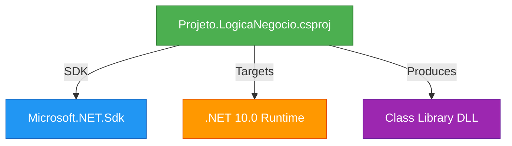

---

## ?? Purpose and Functionality

### Role in Application Architecture

This project follows the **N-Tier Architecture** pattern, specifically acting as the **Business Logic Layer (BLL)**.

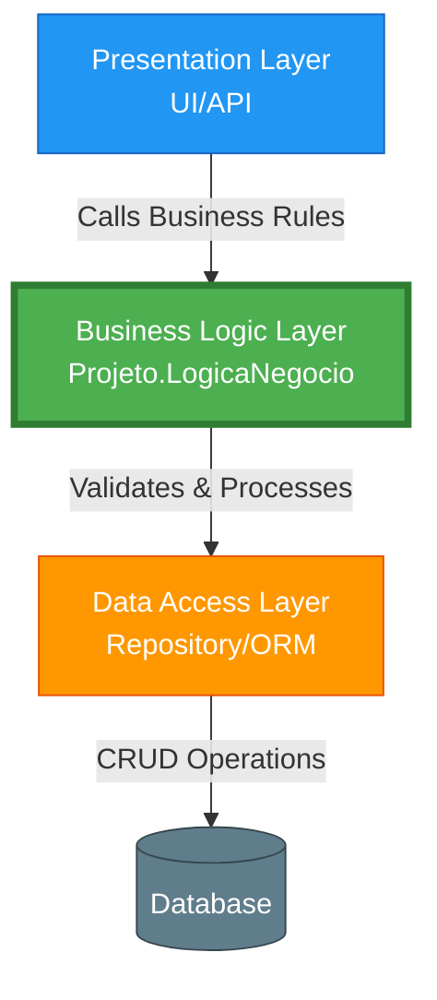

### Typical Responsibilities

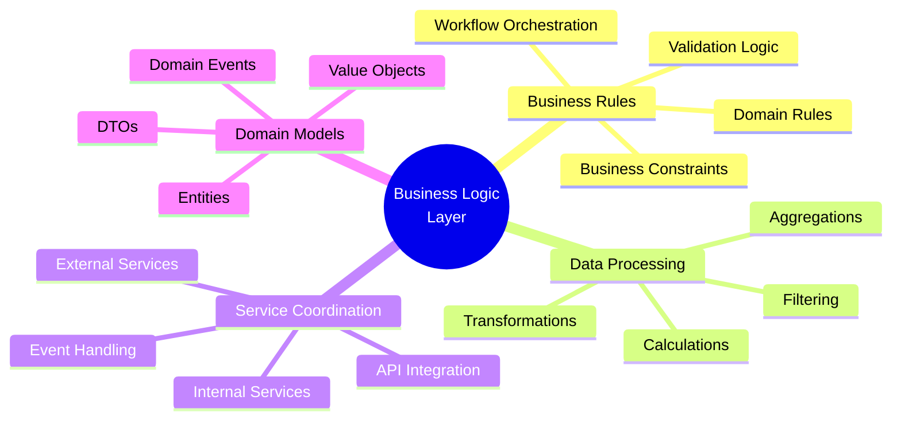

---

## ?? Technical Characteristics

### SDK Properties

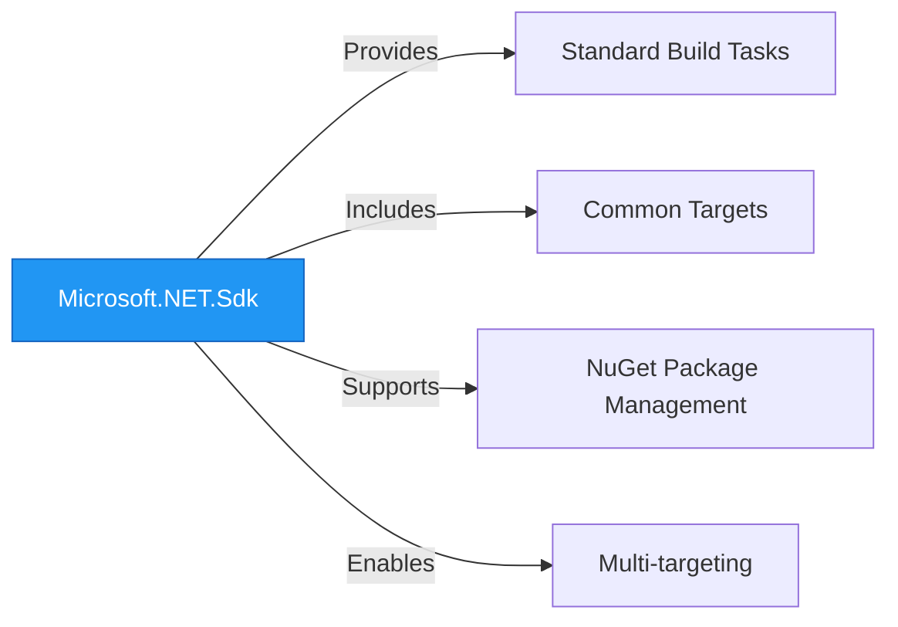

### .NET 10.0 Features Available

As a .NET 10.0 project, this library can leverage:

- ? **C# 13** language features
- ? **Latest BCL APIs** (Base Class Library)
- ? **Performance improvements** in runtime
- ? **Enhanced nullable reference types**
- ? **Record types and pattern matching**
- ? **Minimal API compatibility** (if exposed via web projects)
- ? **Native AOT support** (if configured)

---

## ?? Project Dependencies

### Implicit Dependencies

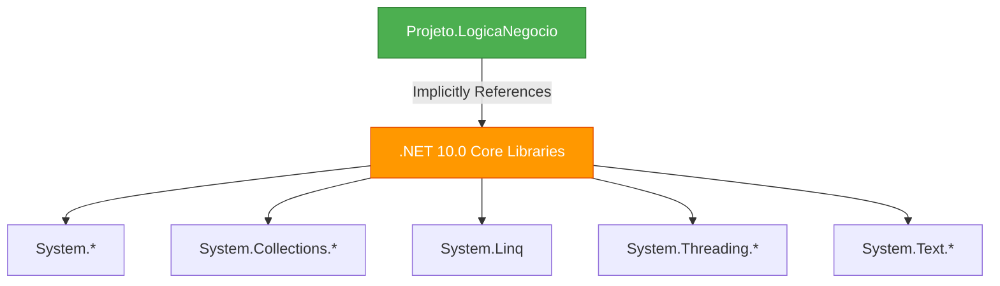

### Current State

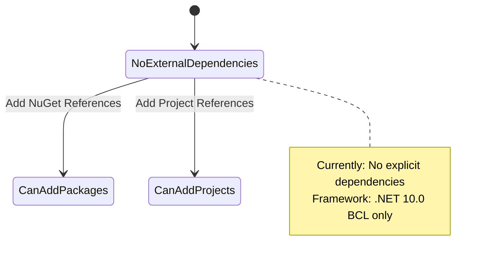

---

## ?? Build and Output Process

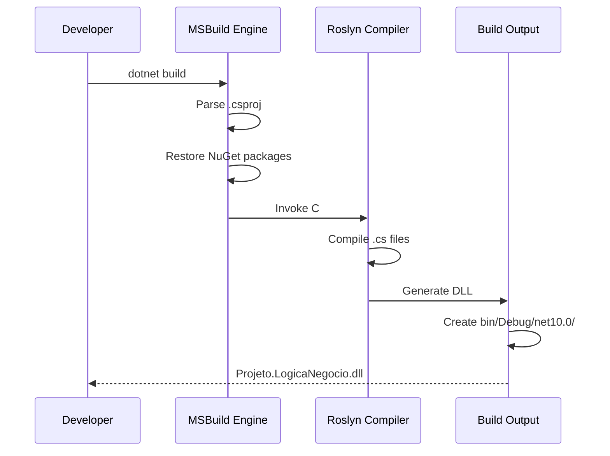

### Build Output Structure

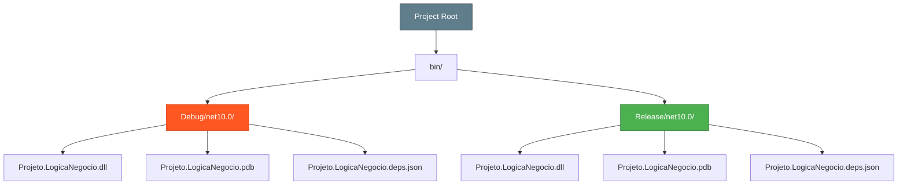

---

## ?? Usage Scenarios

### Typical Integration Pattern

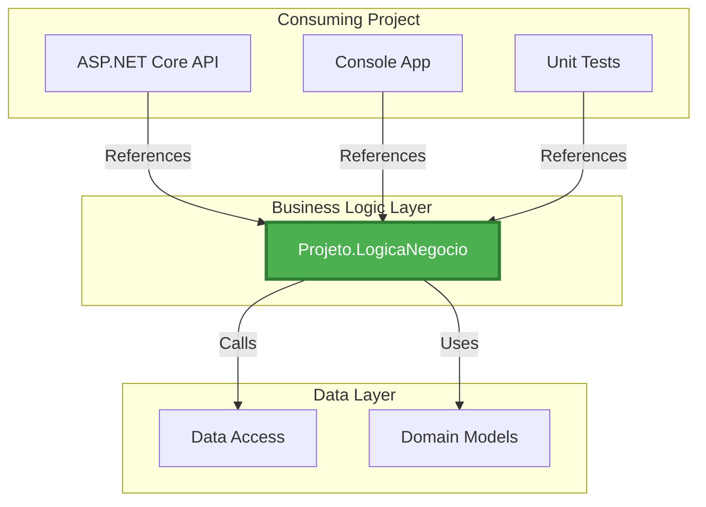

### Example Reference in Consuming Project

```xml
<Project Sdk="Microsoft.NET.Sdk.Web">
  <PropertyGroup>
    <TargetFramework>net10.0</TargetFramework>
  </PropertyGroup>
  
  <ItemGroup>
    <ProjectReference Include="..\Projeto.LogicaNegocio\Projeto.LogicaNegocio.csproj" />
  </ItemGroup>
</Project>
```

---

## ?? Lifecycle and Operations

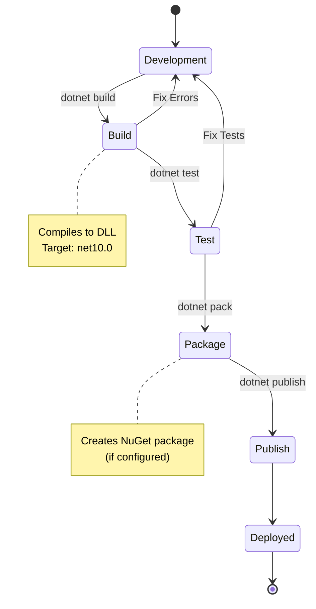

---

## ?? Project Characteristics Summary

| Characteristic | Value | Description |
|---------------|-------|-------------|
| **Complexity** | ? Minimal | Simplest possible .csproj configuration |
| **Dependencies** | 0 explicit | Only framework libraries |
| **Target** | Single | net10.0 only |
| **Output Type** | Library | Class library DLL |
| **Portability** | High | Can be referenced by any .NET 10+ project |

---

## ?? Best Practices for This Project

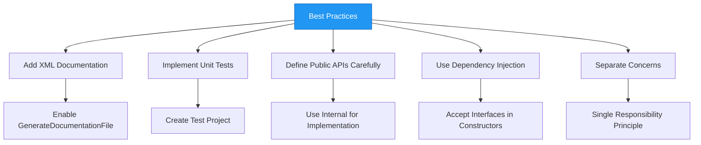

---

## ?? Recommended Enhancements

To make this project more robust, consider adding:

```xml
<Project Sdk="Microsoft.NET.Sdk">

  <PropertyGroup>
    <TargetFramework>net10.0</TargetFramework>
    
    <!-- Documentation -->
    <GenerateDocumentationFile>true</GenerateDocumentationFile>
    
    <!-- Code Analysis -->
    <EnableNETAnalyzers>true</EnableNETAnalyzers>
    <AnalysisLevel>latest</AnalysisLevel>
    
    <!-- Nullable Reference Types -->
    <Nullable>enable</Nullable>
    
    <!-- Package Metadata (if publishing to NuGet) -->
    <Authors>Your Name</Authors>
    <Company>Your Company</Company>
    <Description>Business logic layer for Projeto application</Description>
  </PropertyGroup>

</Project>
```

---

## ?? Summary

**Projeto.LogicaNegocio** is a clean, minimal .NET 10.0 class library designed to encapsulate business logic in a layered application architecture. Its simplicity makes it easy to maintain while providing the full power of the latest .NET framework features.

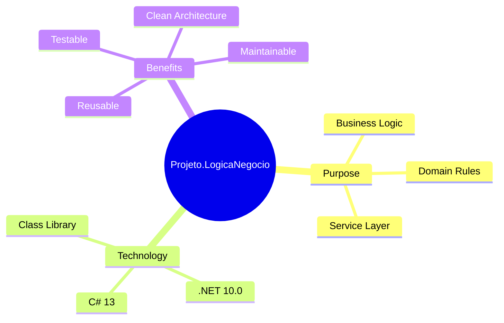

---

## ?? Additional Resources

- [.NET 10.0 Documentation](https://docs.microsoft.com/dotnet/)
- [C# 13 Language Features](https://docs.microsoft.com/dotnet/csharp/)
- [Clean Architecture Principles](https://docs.microsoft.com/dotnet/architecture/)
- [Dependency Injection Best Practices](https://docs.microsoft.com/dotnet/core/extensions/dependency-injection)

---

**Document Generated:** 2025
**Project Version:** .NET 10.0
**Repository:** https://github.com/MoongyProjetos/hello-dotnet10
